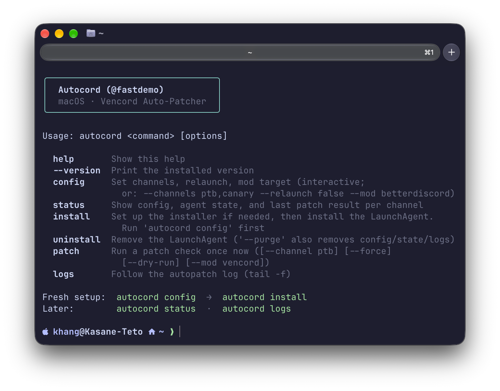

# Autocord

Background tool for macOS that repatches BetterDiscord or Vencord on every Discord update, so you don't have to manually install them every single time!

## Highlights

Autocord is a lightweight CLI + background watcher that keeps your Discord client mod patched across updates. The sole purpose is whenever Discord auto-updates and wipes the patch, Autocord detects the new version and re-patches it automatically.

## Preview



## Features

* **Update-proof Vencord**: A `launchd` agent watches both the live `.app` bundle and the Application Support folders (Discord replaces the bundle via ShipIt on every update), debounces the flurry of file writes, and re-patches only when the version actually changed.
* **One command**: `autocord config`, `autocord install`, `autocord status`, `autocord logs`, `autocord patch` — a single surface over the watcher, trigger, and installer scripts.
* **BetterDiscord dry-run**: BetterDiscord is a real selectable mod target, but patch runs for it only ever report what they *would* do — nothing is touched.
* **Zero-setup installer handling**: The Vencord installer CLI has no prebuilt macOS binary, so Autocord finds it (known locations, then `$PATH`) or builds it from source automatically. You never learn Go is involved.
* **Terminal-only**: Everything runs in your terminal and the background agent. No GUI, no system-wide changes.
* **Lightweight**: Plain Node.js with zero dependencies. Just link it and forget it (until Discord updates, when you'll be glad you did).

## Install

1. Install Node.js:

   ```bash
   brew install node
   ```

2. Clone this repo:

   ```bash
   git clone https://github.com/fastdemo/autocord.git
   ```

3. Enter the folder and install:

   ```bash
   cd autocord
   npm install
   npm link
   ```

4. Make sure Autocord is installed:

   ```bash
   autocord --version
   ```

## Usage

Set it up once:

```bash
autocord config
autocord install
```

Check on it later:

```bash
autocord status
autocord logs
```

Run a patch check by hand:

```bash
autocord patch --dry-run --channel ptb
autocord patch --force
```

Normal Autocord arguments work too:

```bash
autocord patch --channel ptb
autocord patch --mod betterdiscord
autocord config --channels stable,ptb --relaunch false
```

Sample `autocord status`:

```
╭────────────────────────────────╮
│  Autocord (@fastdemo)          │
│  macOS · Vencord Auto-Patcher  │
╰────────────────────────────────╯

config    /Users/khang/.config/vencord-autopatch/config.json
channels  ptb
relaunch  true
mod       vencord

ptb        ● Patched  0.0.260  ·  2026-09-13T06:15:52.197Z
installer  ● ready (VencordInstallerCli-darwin)
agent      ● Not loaded  (run 'autocord install')
```

Bump-test the watcher (fires the agent within seconds; watch `autocord logs`):

```bash
touch "$HOME/Library/Application Support/discord"
```

Advanced — the same tools `autocord` wraps, called directly:

```bash
node src/configure.js --channels ptb --relaunch true
node src/trigger.js --check --channel ptb
node src/trigger.js --force
launchctl list com.vencord-autopatch
```

## Configuration

Autocord creates its configuration at:

```bash
~/.config/vencord-autopatch/config.json
```

Either `autocord config` (numbered prompts: channels, relaunch y/n, mod target) or hand-edit the file — same source, no second copy. Unknown keys are preserved on save.

| Key | Default | Meaning |
|---|---|---|
| `channels` | `["stable"]` | Which builds to watch: `stable`, `ptb`, `canary`, `development` |
| `mod` | `"vencord"` | `vencord` (live patching) or `betterdiscord` (**dry-run only**) |
| `relaunchDiscord` | `false` | Relaunch Discord after a successful patch, if it was running |
| `installerCli` | `~/bin/VencordInstallerCli-darwin` | Manual override; normally auto-resolved → auto-built |
| `installerMode` | `"location"` | `-install --location <appPath>`, or `--branch <channel>` |
| `debounceSeconds` | `10` | Quiet period before acting on filesystem changes |
| `logLevel` | `"info"` | `debug`, `info`, `warn`, `error` |

Channel → paths mapping: `stable` → `Discord.app` + `.../Application Support/discord`, `ptb` → `Discord PTB.app` + `.../discordptb`, `canary` → `Discord Canary.app` + `.../discordcanary`, `development` → `Discord Development.app` + `.../discorddevelopment`.

State (last successfully patched version per channel) lives at `~/.local/share/vencord-autopatch/state.json`.

## Troubleshooting

* **`autocord: command not found`** → Make sure you ran `npm link` inside the Autocord folder.
* **No config yet** → Run `autocord config` first; `autocord install` refuses without one.
* **Installer missing** → Run `autocord install` — it builds the Vencord installer CLI from source automatically instead of asking you for a path.
* **Discord must be quit to patch** → The trigger quits it gracefully first (`tell application … to quit`, `pkill` fallback). Unsaved state like an unsent draft can be lost — same as manual patching.
* **Discord stayed closed after patching** → Relaunch is opt-in; set it with `autocord config --relaunch true`.
* **Nothing happens on update** → Only configured `channels` are watched; re-run `autocord install` after changing channels to regenerate `WatchPaths`.
* **Patch runs overlap** → Overlapping wakes exit early by design; the next wake (or login) picks up missed work from the state file.
* **Something is behaving strangely** → Run `autocord status` and `autocord logs` to see versions, state, and the full log.

## Windows

`src/platform/win32.js` implements the same interface as `darwin.js` (auto-selected), so the trigger loop and mods are shared. Installs live at `%LOCALAPPDATA%\<Discord|DiscordPTB|DiscordCanary|DiscordDevelopment>\app-<ver>\resources\app.asar`, and Task Scheduler polls (`schtasks /create /sc MINUTE /mo 30`) since it has no filesystem-watch trigger. Still needs one confirmation run on a real Windows box (`taskkill` behavior, `Update.exe --processStart` relaunch, toast notification — see `DOCS-UNTESTED` markers).

## Docs

```bash
npm test
```

Runs the test suite for config, trigger, mods, installer resolution, CLI surface, and platform layers.

The main source files are in `src/`:

```text
src/
├── trigger.js
├── configure.js
├── installer.js
├── ui.js
├── config.js
├── state.js
├── logger.js
├── mods/
│   ├── vencord.js
│   ├── betterdiscord.js
│   └── index.js
└── platform/
    ├── darwin.js
    ├── win32.js
    └── index.js
```

Configuration:

```text
~/.config/vencord-autopatch/config.json
```

State:

```text
~/.local/share/vencord-autopatch/state.json
```

## Links

* [Discord](https://discord.com/)
* [Vencord](https://github.com/Vendicated/Vencord)
* [Vencord Installer](https://github.com/Vencord/Installer)
* [BetterDiscord](https://betterdiscord.app/)
* [Autocord](https://github.com/fastdemo/autocord)

## Requirements

* Node.js 18+
* macOS (Windows port in progress — see above)
* Discord (stable, PTB, Canary, and/or Development)

## License

Apache License 2.0. See [LICENSE](LICENSE).

## Disclaimer

Autocord is not affiliated with Discord, Vencord, or BetterDiscord. Patching a client mod can break when Discord ships changes *(and at your own risk, of course).* It's completely open-source and intended for personal use.

Made with love by **@fastdemo** <3
